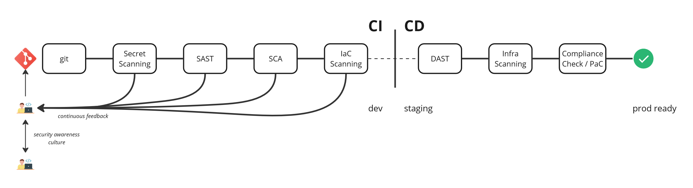
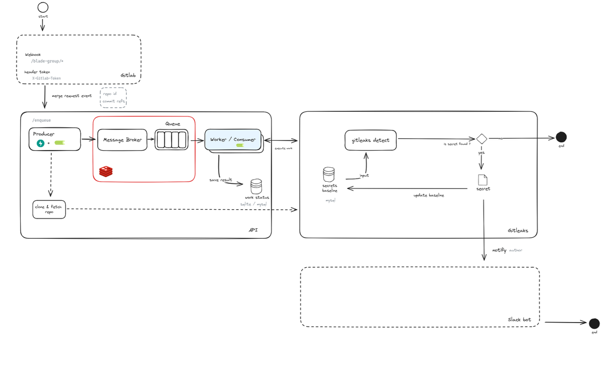

# Mise en place des pratiques au sein de Shadow

Dans son contexte et dans son processus de développement, Shadow prit la
décision de s'orienter vers la philosophie DevOps en mettant en place un
certain nombre de procédés et d'outillages pour automatiser la mise en
condition opérationnelle de ses produits et de ses outils internes.

Dans cette optique nous avons également voulu remettre la sécurité au
centre de ces procédés pour nous permettre de réaliser un Shift Left
avec nos processus de sécurité. Nous allons donc aborder dans cette
partie les pratiques DevOps déjà en place chez Shadow avant de parler de
notre plan vers le Shift Left puis nous verrons les actions et outils
que j'ai mis en place pour concrétiser ce plan et nous finirons par une
projection sur l'automatisation des processus de détection et de
réponse.

## Shift Left Retro Planning

Pour commencer à Shift Left, la première des choses est de réaliser une
prise de conscience au sein de l'équipe sécurité d'un besoin d'évolution
en ce qui concerne les pratiques de sécurité déjà en place au sein du
cycle de développement. Par la suite réaliser un Shift Left implique une
symbiose entre évolution culturelle, entraînement, intégration d'outils
et de nouveau processus.

Pour cela, Florent, Head of Security chez Shadow, intégra dans la vision
long terme de la politique de sécurité de Shadow des étapes en vue de
réaliser un Shift Left au sein de nos processus. Parmi ces étapes nous
pouvons retrouver :

i.  la sensibilisation des collaborateurs aux problématiques de sécurité
    de l'organisation,

ii. l'intégration de différents outils permettant l'automatisation de
    certains processus,

iii. la mise en places de pratiques DevSecOps,

iv. la gestion de vulnérabilité,

v.  la modélisation des menaces auxquelles Shadow pourrait faire face.

Certaines de ces étapes ont pu être réalisées en parallèle pendant que
d'autres nécessitent une certaine maturité organisationnelle pour être
débutées comme la modélisation des menaces. Cela est possible car Shadow
s'est naturellement tourné vers une approche DevOps dans sa genèse. Bien
qu'elles ne soient pas un prérequis pour réaliser un Shift Left, les
pratiques DevOps procurent une bonne base pour procéder à ce changement
tout comme l'approche DevSecOps se présente comme un fil rouge pour nous
aider dans notre démarche.

### DevOps chez Shadow

DevOps est avant tout une approche collaborative entre les équipes de
développement et les équipes opérationnelles qui se suit par un certain
nombre de pratiques et d'automatisation tout au long du cycle de
développement. Shadow possède dans toutes ses équipes un cycle
d'intégration continue et de déploiement continu (CI/CD). Ces derniers
incluent la plupart du temps une phase de linting, packaging puis de
build intégré à des outils relativement modernes bien que variant d'une
équipe à l'autre.

Par conséquent notre prochaine étape dans
l'évolution de nos pratiques DevOps consiste à standardiser nos procédés
et nos outils tout en incluant les tests de sécurité au plus tôt dans
nos CI.

## Pratiques DevSecOps chez Shadow

Nous avons souligné que l\'adoption d\'une approche DevSecOps engage
tous les métiers intervenant dans le cycle de développement, en les
rendant responsables de la sécurité. Cette culture est tout aussi
essentielle que l\'automatisation des processus. C\'est pourquoi nous
avons mis en place un programme de sensibilisation à la sécurité
informatique à destination de nos collaborateurs.

### Programme de sensibilisation

Pour établir une culture de collaboration sur les sujets de sécurité
nous devons sensibiliser nos collaborateurs aux risques de sécurité, aux
bonnes pratiques et aux différents types d'attaque qui existent,
notamment celle à laquelle ils sont le plus susceptibles d'être
vulnérable : le phishing. En effet la majorité des organisations qui se
font compromettre réussissent un accès initial grâce aux phishings car
un collaborateur n'a pas été assez précautionneux dans la vérification
de l'authenticité de l\'e-mail reçu.

Mon objectif était donc de trouver une solution permettant de faire
grandir les connaissances en sécurité de l'information au sein de sein
de Shadow, tout en entraînant nos collègues à être alerte lors de la
réception d'un e-mail paraissant suspect.

Cela nous a nécessités différentes étapes

i.  Comprendre les lacunes et les besoins de renforcement en culture de
    sécurité informatique

ii. Entraîner nos collaborateurs de manière régulière

iii. Evaluer les progrès avec des exercices de simulations

iv. Répéter cela dans une optique d'amélioration continue

Dans une philosophie d'automatisation de processus de sécurité, nous
avons compris que réaliser ces étapes manuellement avec la taille de
notre équipe de sécurité serait très chronophage et perdrait
continuellement de la valeur par rapport à nos occupations quotidiennes.
La charge qui m'a été accordée fut de faire une analyse comparative de
différentes solutions et services de sensibilisation à la sécurité
informatique proposant des modules d'entraînement. Je me suis donc basé
sur la liste de fonctionnalité suivante avec leur priorité pour choisir
une solution correspondant à nos besoins. (Voir annexe 2)

Après avoir établi une liste de solutions open source et payantes, en
priorisant les solutions européennes, car Shadow s\'oriente vers la
souveraineté numérique, j\'ai dû évaluer chacune de ces solutions à
travers des échanges commerciaux, des démonstrations et des phases de
PoC (preuve de concept) sur une population donnée d\'employés de Shadow,
puis filtrer celles qui nous convenaient aussi bien fonctionnellement
que financièrement. Le ressenti des futurs utilisateurs a également été
pris en compte dans le choix de la solution, ce qui nous a permis
d\'obtenir une moyenne pondérée de chaque solution à l\'aide des notes
que les utilisateurs --- nos collaborateurs --- ont pu attribuer à ces
solutions en se basant sur des critères préalablement définis.

J'introduis donc Riot une solution dédiée à la sensibilisation à la
sécurité informatique. Elle vise à former les employés d\'une entreprise
aux bonnes pratiques en matière de sécurité informatique. Riot propose
une approche ludique et engageante pour aider les utilisateurs à mieux
comprendre les menaces de sécurité et à adopter les comportements
appropriés pour se protéger et protéger leur organisation.

Voici quelques caractéristiques de Riot :

i.  **Phishing Simulation** : Riot permet de créer des campagnes de
    simulation d\'attaques de phishing pour évaluer et former les
    employés à reconnaître les tentatives d\'hameçonnage.

ii. **Formation via Albert** : La plateforme propose des modules
    interactifs et des quiz pour sensibiliser les utilisateurs aux
    risques liés à la sécurité informatique réaliser par Albert un robot
    qui envoie des messages de sensibilisation directement dans
    l\'environnement de travail des utilisateurs, Slack pour notre cas.

iii. **Personnalisation** : Les contenus de formation peuvent être
     personnalisés en fonction de nos besoins et du niveau de
     connaissance des utilisateurs.

iv. **Suivi et Reporting** : Riot fournit des outils pour suivre
    l\'engagement des utilisateurs et mesurer l\'efficacité des
    campagnes de sensibilisation.

v.  **Approche Ludique** : Pour rendre l\'apprentissage plus attractif,
    Riot intègre des éléments de gamification, comme des scores et des
    classements.

Riot est pour nous un outil complet pour renforcer notre posture en
sécurité informatique en impliquant activement nos collègues dans le
processus de sensibilisation. Cela favorise une culture de collaboration
et d\'échange sur les sujets de sécurité que nous souhaitons instaurer.

Parallèlement à cette sensibilisation continue, nous avons poursuivi
notre programme de Shift Left en développant un outil de détection de
valeurs secrètes pour nos projets internes versionnés sur GitLab

### Détection de secrets

La détection de secrets sur les projets versionnés est l'une des
premières étapes dans un processus de Shift Left. L'objectif étant de
s'assurer qu'aucune information sensible ne soit retrouvée sur un dépôt
git. En effet plusieurs compromissions surviennent suite à la découverte
d'informations sensibles poussée sur des projets comme des clés d'API.
Nous devons donc analyser nos commits à la recherche de toutes données
secrètes.

L\'approche idéale consiste à détecter et à prévenir l\'exposition de
données sensibles avant qu\'elles n\'atteignent le dépôt, car elles sont
alors visibles dans l\'historique. Dans le cas des plateformes
d\'hébergement de code, les secrets peuvent encore traîner sur le web et
faire l\'objet de recherches après avoir été retirés du dépôt. Une
approche complémentaire consiste à analyser le dépôt à la recherche
d\'informations sensibles, puis à les supprimer ; il convient de noter
que si des informations confidentielles sont divulguées, c\'est
qu\'elles sont déjà compromises et qu\'elles doivent être invalidées. La
détection de secrets implique donc d'avoir une bonne méthodologie de
gestion de secrets au sein de l'organisation. Nous utilisons la solution
Vault de Hashicorp à cet effet. Elle permet de stocker les secrets de
manière sécurisée, en les chiffrant avant de les sauvegarder dans une
base de données. Vault fournit un système de contrôle d\'accès rigoureux
qui définit qui peut accéder à quels secrets. Les politiques d\'accès
peuvent être configurées pour permettre un contrôle granulaire. En plus
de cela il est également possible de gérer la rotation des clés et de
créer des automatisations avec toutes ces fonctionnalités. Chez Shadow
notre plateforme de gestion de secrets est automatiquement déployée et
configuré de manière déclarative en Infra as Code, réduisant d'office la
charge de travail pour toutes les équipes.

De ce fait nous savons que faire lors de l'identification d'un nouveau
secret.

#### Comment détecter des secrets

Pendant notre processus de réflexion sur la mise en place de cette
pratique au sein des équipes de développement de Shadow, nous avons fait
une étude sur la détection de secrets sur les dépôts git et l'endroit
idéal pour le faire selon notre contexte. Il est intéressant de noter
que Shadow, de son passé de start-up a gardé un long moment une
philosophie delivery-first, c'est-à-dire prioriser la livraison aux
détails opérationnels ou de sécurité. De ce fait chaque équipe n'est pas
alignée sur un standard dans leur cycle de développement. Ainsi, dans
une vision d'implémentation de bonnes pratiques et d'amélioration des
processus en cours nous avons quelques contraintes organisationnelles et
une once de nostalgie vis-à-vis des processus déjà en place.

Nous avons vu que la détection de secrets peut se faire

-   **Localement** avant que le code ne soit versionné à l'aide de
    pre-commit, ce qui implique une détection préalable du secret bien
    que dépendant de la volonté de l'utilisateur à implémenter l'outil
    proposé

-   **Pendant l'intégration continue** (CI), un secret détecté à ce
    niveau serait déjà compromis, néanmoins l'équipe en charge serait la
    mieux placée pour juger de la pertinence du secret détecté, du
    processus d'invalidation et de la correction du code impliqué.

-   **Durant une analyse des sources après que le code ait été poussé**,
    cela est à la charge de l'équipe sécurité et implique une bonne
    gestion des secrets remontée tout en prenant en compte
    l'identification des faux positifs. Le défaut étant que ce procédant
    est non bloquant dans le cycle de développement et le processus
    d'invalidation, restant à la charge des équipes de développement ne
    serait pas nécessairement immédiat.

Cette dernière solution nous a paru être un bon compromis pour notre
situation. Nous avons donc développé Gitleaker, une API de détection de
secrets exposées qui agit à chaque fois qu'un nouveau code est poussé
sur notre espace au sein de la plateforme GitLab et notifie l'auteur sur
Slack en cas de nouveaux secrets exposés.

#### Gitleaker

Gitleaker utilise *gitleaks* comme outil de détection de secrets, il
permet de rechercher divers types d'information sensible en se basant
sur le contenu de l'historique de commits. D'autres outils existent
comme

-   *gittyleaks* : Recherche d\'informations sensibles pour un dépôt git
    un peu comme *gitleaks*, cependant il est plus vieux et moins
    maintenu que *gitleaks*.

-   *git-secrets* : Empêche de versionner des secrets grâce à un module
    complémentaire qui s'intègre à la commande *git.*

Voici un schéma d'architecture décrivant
également le processus de traitement d'une requête

Durant le processus de développement j'ai dû prendre en compte diverses
contraintes pour assurer que l'API supporte de fortes charges et soit à
même d'évoluer rapidement. D'où la présence d'un modèle de file
d'attente utilisant Redis et la librairie python celery. J'ai également
pu éprouver le cycle d'intégration et de déploiement en continu expliqué
plus haut afin de justifier l'application de nouvelles pratiques
DevSecOps nous permettant d'adopter une approche de Shift Left.

La détection de secret n'est qu'une première brique dans l'exécution de
tests de sécurité au sein de notre cycle d'intégration continue. La
prochaine étape est d'ajouter des outils d'analyse statique et dynamique
de code pour identifier les vulnérabilités qui s'y cache et d'avoir une
approche de gestion de ces vulnérabilités permettant d'évaluer, atténuer
ou remédier le risque d'exploitation de ces dernières. Dans cette
optique nous avons identifié DefectDojo.

#### DefectDojo

DefectDojo est une plateforme de gestion de vulnérabilités open source
proposant des fonctionnalités d'importation de rapports d'une multitude
d'outils de sécurité, de suivi d'état de la vulnérabilité --- de
l'identification à la remédiation ou l'acceptation --- de déduplication
avec les vulnérabilités déjà remontées et possède une API permettant de
réaliser diverses intégrations et automatisation entre nos outils et les
fonctionnalités offertes par la plateforme.

En vue d'intégrer cette plateforme à notre catalogue, je me suis chargé
de juger la pertinence de cette dernière dans un environnement local en
créant un processus automatisé dont l'objet fut d'importer les résultats
d'une analyse statique de code --- utilisant Semgrep un outil d'analyse
multilangage --- réalisé à chaque nouveau code poussé sur le dépôt.
L'objectif étant que chaque utilisateur ayant accès à la plateforme soit
responsable de l'état de la vulnérabilité identifié, l'équipe sécurité
s'occupant de l'accompagnement des équipes dans la qualification et les
possibilités de remédiation.

Concrètement ce processus automatisé se présente comme un ensemble de
scripts bash intégré à GitLab CI, nous permettant de définir un grand
nombre de flux et d'actions à réaliser suite à des événements survenant
sur le dépôt. À moyen terme, nous avons l\'intention de distribuer ce
modèle pour l\'intégrer à tous les projets de Shadow et faciliter ainsi
l\'intégration des outils d\'analyse statique et dynamique à toutes les
équipes.

Pour poursuivre avec les processus de sécurité automatisés dans notre
équipe, abordons comment les phases de détection et de réponse sont
planifiées chez Shadow et quels procédés j'ai pu améliorer pour
amoindrir la charge de travail de l'équipe sécurité.

## Automatisation des processus de détection et de réponse chez Shadow

### Détection

En plus de la détection d'incident, chez Shadow nous avons également la
détection de fraude et d'abus d'utilisation de nos services. En ce qui
concerne Shadow PC, nous avons des requêtes au sein de nos différents
outils qui remontent les paiements suspicieux et les comptes
potentiellement abusifs, cependant le processus de vérification de ces
alertes est chronophage et répétitif. Nous développons des plateformes
et API internes pour réaliser certaines de ces tâches de manière
automatiques. Pour Shadow Drive, j'ai eu l'honneur pendant mon projet de
fin d'étude de mettre en place les premiers éléments de détections et de
prévention d'intrusion sur notre infrastructure.

En effet je mentionne dans mon mémoire que

> Nous avons donc vu qu'il était nécessaire de connaître avant toute
> chose les besoins de l'entreprise en termes de sécurité en réalisant
> une analyse de besoins suivie d'une analyse de risques. Puis de
> définir un protocole de test car il sera notre boussole lors de
> l'évaluation des solutions de sécurité qui s'offrent à nous. Dans
> notre cas, nous avons étudié les solutions éditées par OGO Security,
> CrowdSec et UBIKA qui sont des boîtes françaises spécialisés dans la
> cybersécurité. Cette étude nous a prouvé que l'agent CrowdSec était le
> meilleur compromis pour nous avec un rapport protection coût
> acceptable à l'heure actuelle. Enfin pour pérenniser la sécurité de
> notre infrastructure et l'efficacité de la solution choisie, nous
> avons jugé bon de définir un processus d'amélioration continue après
> avoir déployé en production ladite solution. (Olea, 2023)

Depuis la mise ne place de manière industrielle de CrowdSec, nous avons
commencé à être alertés des robots qui analysent internet à la recherche
de vulnérabilités, à bloquer de manière automatique les comportements
suspects et améliorer les capacités de la solution à ne pas notifier les
faux positifs.

De plus notre équipe étudie le déploiement de Wazuh un XDR présenté plus
haut sur tous les terminaux et serveurs de l'entreprise pour une
surveillance optimale des événements qui s'y produisent.

En parallèle nous éprouvons également les possibilités de nos
plateformes et outils à nous accompagner dans la résolution de nos
incidents. Voyons donc comment nous y parvenons.

### Réponse

Comme vu dans l'Etat de l'art, automatiser la phase de réponse à
incident en interne demande une certaine maturité de ses différents
processus et un rapport bénéfice, coût, probabilité et impact d'une
erreur sur le processus automatisé acceptable pour l'organisation. Chez
Shadow notre gestion d'incident est grandement manuelle. Nous profitons
des fonctionnalités de nos outils pour nos investigations et
externalisons les cas d'analyse forensique. Par exemple, CrowdSec
possède un mode **replay** qui permet de rejouer un fichier de
journalisation afin d'y retrouver des signes de comportement malicieux
et approfondir la recherche de preuves de compromission ou d'intrusion.

Étant en cours de Shift Left, nous restons proactifs et définissons
continuellement de nouvelles étapes dans notre démarche et apprenons à
chaque nouveau jalon atteint dans notre planification.

## Amélioration continue et prochaines étapes

Dans une optique d'amélioration continue de nos processus, chez Shadow
et en général, une équipe de sécurité se doit de remettre ses pratiques
en question pour les faire évoluer. La sécurité est un voyage, il est
tout à fait normal de changer de route lorsque celle que nous suivons
semble nous éloigner de notre destination.

C'est pourquoi, nous avons déjà prévu la suite de nos actions avec ce
que nous avons déjà en place.

i.  L'ajout au sein de nos CI/CD d'outils d'analyse dynamique.

ii. Poursuivre avec la vérification en continue de conformité selon
    différents standards industriels comme SecNumCloud ou PCI DSS.

iii. Nous avons cité plus haut la gestion de vulnérabilité
     semi-automatisée avec la plateforme open source DefectDojo.

iv. La détection de comportements frauduleux dans le contexte de Shadow
    Drive grâce à CrowdSec notamment la création automatique de compte
    ou tout usage qui sortirait de nos conditions.

v.  L'implémentation de CrowdSec au sein de toutes les équipes afin de
    profiter de la fonctionnalité de partage d'information entre les
    différentes instances de la solution.

vi. L'affinement des processus de réponse et l'intégration de nos
    différents outils à une plateforme unique de gestion d'événements.

Ces différents éléments sont une liste non exhaustive de ce que nous
avons prévu de faire pour parfaire ce que nous faisons dans l'équipe
sécurité tout en intégrant nos collaborateurs car nous avons un objectif
commun : la satisfaction de nos utilisateurs en garantissant le maintien
en condition opérationnelle de nos services.

