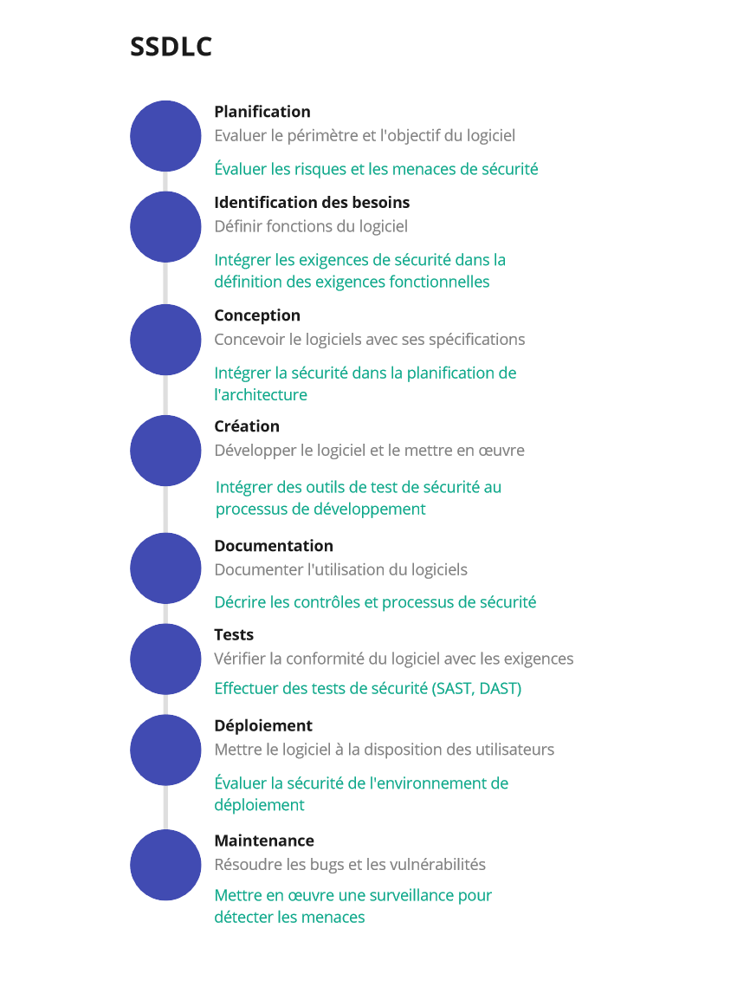

# Annexes

## Le cycle de développement sécurisé

## Fonctionnalités d'une solution de sensibilisation à la sécurité

  **Fonctionnalité**                                               **Priorité**
  ---------------------------------------------------------------- --------------
  Simulateur de campagne de phishing                               1
  Personnaliser le contenu                                         1
  Catalogue de cours et de documents de formation                  1
  Variété de modèles                                               1
  Intégration Slack                                                1
  Automatiser les simulations de phishing                          2
  Rapports d\'analyse                                              2
  Attribution de contenu dynamique                                 2
  Suivi de l\'apprentissage                                        2
  Gamification de la sensibilisation                               2
  Interface Web                                                    2
  Facile à utiliser                                                2
  Simulation de pièces jointes à des courriels                     3
  Évaluation du risque sur le point de défaillance de l\'employé   3
  Possibilité pour l\'utilisateur de signaler un courriel          3
  Interface graphique                                              4
  IA / Holistique                                                  4

[]Tableau 1 Tableau de priorisation des
fonctionnalités d\'une solution de sensibilisation à la sécurité

